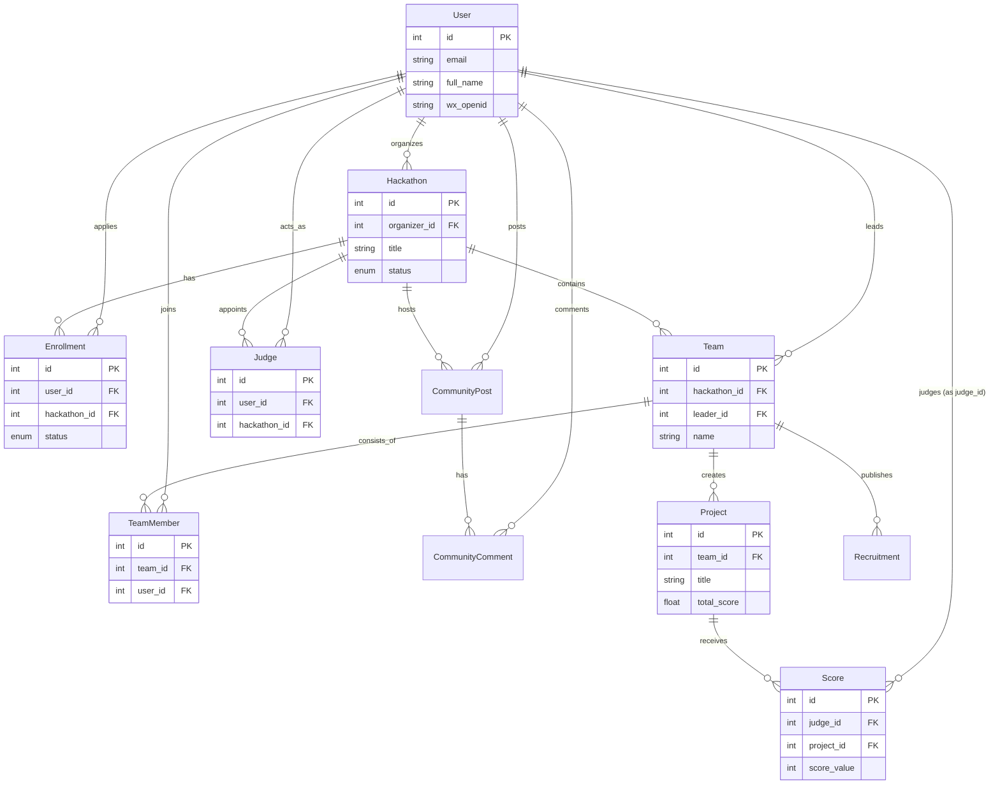

# 数据库架构指南 (Database Guide)

## 1. 数据库概览

本项目后端使用 **Python** 开发，基于 **FastAPI** 框架，采用 **SQLModel** (结合了 SQLAlchemy 和 Pydantic) 作为 ORM（对象关系映射）层。

*   **数据库类型**: 目前默认配置为 **SQLite** (`sqlite:///./vibebuild.db`)，便于开发和演示。代码中保留了 **PostgreSQL** 的配置支持，可随时切换至生产环境数据库。
*   **核心逻辑**: 系统围绕“黑客松（Hackathon）”这一核心实体展开，关联用户（User）、组队（Team/TeamMember）、项目作品（Project）、报名（Enrollment）、评审（Judge/Score）以及社区互动（CommunityPost/Comment）等功能模块。
*   **迁移工具**: 使用 **Alembic** 进行数据库版本控制和迁移。

---

## 2. 数据字典

### 2.1 用户表 (User)
存储所有注册用户的基本信息、认证状态及 AI 匹配所需的画像数据。

| 字段名 | 数据类型 | 键 | 默认值 | 说明 |
| :--- | :--- | :--- | :--- | :--- |
| `id` | Integer | **PK** | Auto Inc | 用户唯一标识 |
| `email` | String | UK, IDX | | 用户邮箱，用于登录和通知 |
| `hashed_password` | String | | None | 加密后的密码（若使用微信登录则可能为空） |
| `full_name` | String | | None | 用户真实姓名 |
| `nickname` | String | | None | 用户昵称 |
| `avatar_url` | String | | None | 头像链接 |
| `is_active` | Boolean | | True | 账户是否启用 |
| `is_superuser` | Boolean | | False | 是否为超级管理员 |
| `is_verified` | Boolean | | False | 是否完成实名认证 |
| `wx_openid` | String | UK, IDX | None | 微信 OpenID |
| `wx_unionid` | String | IDX | None | 微信 UnionID |
| `skills` | String | | None | 技能标签（JSON 或逗号分隔字符串） |
| `interests` | String | | None | 兴趣方向（JSON 或逗号分隔字符串） |
| `city` | String | | None | 所在城市 |
| `phone` | String | | None | 联系电话 |
| `personality` | String | | None | MBTI 或性格描述 |
| `bio` | String | | None | 个人简介 |

### 2.2 验证码表 (VerificationCode)
用于存储邮箱验证码，处理注册或密码重置流程。

| 字段名 | 数据类型 | 键 | 默认值 | 说明 |
| :--- | :--- | :--- | :--- | :--- |
| `id` | Integer | **PK** | Auto Inc | 唯一标识 |
| `email` | String | IDX | | 关联邮箱 |
| `code` | String | | | 验证码内容 |
| `expires_at` | DateTime | | | 过期时间 |
| `created_at` | DateTime | | Now | 创建时间 |
| `is_used` | Boolean | | False | 是否已使用 |

### 2.3 黑客松表 (Hackathon)
核心活动表，定义比赛的规则、时间轴和详情。

| 字段名 | 数据类型 | 键 | 默认值 | 说明 |
| :--- | :--- | :--- | :--- | :--- |
| `id` | Integer | **PK** | Auto Inc | 活动唯一标识 |
| `organizer_id` | Integer | FK | | 关联主办方（User.id） |
| `title` | String | | | 活动标题 |
| `subtitle` | String | | None | 副标题 |
| `description` | String | | | 活动详细描述 |
| `cover_image` | String | | None | 封面图链接 |
| `theme_tags` | String | | None | 主题标签 |
| `registration_type` | Enum | | TEAM | 报名类型（个人/团队） |
| `format` | Enum | | ONLINE | 比赛形式（线上/线下） |
| `location` | String | | None | 线下地点 |
| `start_date` | DateTime | | | 活动开始时间 |
| `end_date` | DateTime | | | 活动结束时间 |
| `status` | Enum | | DRAFT | 活动状态（草稿/已发布/进行中/已结束） |
| `awards_detail` | String | | None | 奖项详情 (JSON) |
| `rules_detail` | String | | None | 规则详情 |
| `scoring_dimensions`| String | | None | 评分维度配置 (JSON) |
| `created_at` | DateTime | | Now | 创建时间 |

### 2.4 报名表 (Enrollment)
记录用户报名参加特定黑客松的状态。

| 字段名 | 数据类型 | 键 | 默认值 | 说明 |
| :--- | :--- | :--- | :--- | :--- |
| `id` | Integer | **PK** | Auto Inc | 唯一标识 |
| `user_id` | Integer | FK | | 参赛用户 |
| `hackathon_id` | Integer | FK | | 对应活动 |
| `status` | Enum | | PENDING | 报名状态（待审核/通过/拒绝） |
| `joined_at` | DateTime | | Now | 报名时间 |

### 2.5 队伍表 (Team)
参赛队伍信息。

| 字段名 | 数据类型 | 键 | 默认值 | 说明 |
| :--- | :--- | :--- | :--- | :--- |
| `id` | Integer | **PK** | Auto Inc | 队伍唯一标识 |
| `hackathon_id` | Integer | FK | | 所属活动 |
| `leader_id` | Integer | FK | | 队长（User.id） |
| `name` | String | | | 队伍名称 |
| `description` | String | | None | 队伍简介 |
| `looking_for` | String | | None | 招募需求描述 |
| `created_at` | DateTime | | Now | 创建时间 |

### 2.6 队员表 (TeamMember)
队伍成员关联表。

| 字段名 | 数据类型 | 键 | 默认值 | 说明 |
| :--- | :--- | :--- | :--- | :--- |
| `id` | Integer | **PK** | Auto Inc | 唯一标识 |
| `team_id` | Integer | FK | | 所属队伍 |
| `user_id` | Integer | FK | | 队员用户 |
| `joined_at` | DateTime | | Now | 加入时间 |

### 2.7 招募信息表 (Recruitment)
队伍发布的招募需求。

| 字段名 | 数据类型 | 键 | 默认值 | 说明 |
| :--- | :--- | :--- | :--- | :--- |
| `id` | Integer | **PK** | Auto Inc | 唯一标识 |
| `team_id` | Integer | FK | | 发布队伍 |
| `role` | String | | | 招募角色（如前端、设计） |
| `skills` | String | | | 所需技能 |
| `count` | Integer | | 1 | 招募人数 |
| `status` | Enum | | OPEN | 状态（开放/关闭） |
| `created_at` | DateTime | | Now | 发布时间 |

### 2.8 项目/作品表 (Project)
队伍提交的参赛作品。

| 字段名 | 数据类型 | 键 | 默认值 | 说明 |
| :--- | :--- | :--- | :--- | :--- |
| `id` | Integer | **PK** | Auto Inc | 作品唯一标识 |
| `team_id` | Integer | FK | | 所属队伍 |
| `title` | String | | | 作品名称 |
| `description` | String | | | 作品描述 |
| `tech_stack` | String | | None | 技术栈 |
| `demo_url` | String | | None | 演示链接 |
| `repo_url` | String | | None | 代码仓库链接 |
| `status` | Enum | | SUBMITTED| 状态（已提交/评分中/已评分） |
| `total_score` | Float | | 0.0 | 总得分 |
| `created_at` | DateTime | | Now | 提交时间 |

### 2.9 评委表 (Judge)
记录被指定为某场活动评委的用户。

| 字段名 | 数据类型 | 键 | 默认值 | 说明 |
| :--- | :--- | :--- | :--- | :--- |
| `id` | Integer | **PK** | Auto Inc | 唯一标识 |
| `user_id` | Integer | FK | | 评委用户 |
| `hackathon_id` | Integer | FK | | 对应活动 |
| `appointed_at` | DateTime | | Now | 任命时间 |

### 2.10 评分表 (Score)
记录评委对项目的打分详情。

| 字段名 | 数据类型 | 键 | 默认值 | 说明 |
| :--- | :--- | :--- | :--- | :--- |
| `id` | Integer | **PK** | Auto Inc | 唯一标识 |
| `judge_id` | Integer | FK | | 打分评委（User.id） |
| `project_id` | Integer | FK | | 被评项目 |
| `score_value` | Integer | | | 分数值 (0-100) |
| `details` | String | | None | 细分维度得分 (JSON) |
| `comment` | String | | None | 评语 |
| `created_at` | DateTime | | Now | 打分时间 |

### 2.11 社区帖子表 (CommunityPost)
活动讨论区的帖子。

| 字段名 | 数据类型 | 键 | 默认值 | 说明 |
| :--- | :--- | :--- | :--- | :--- |
| `id` | Integer | **PK** | Auto Inc | 唯一标识 |
| `hackathon_id` | Integer | FK | | 所属活动 |
| `author_id` | Integer | FK | | 发帖人 |
| `title` | String | | | 标题 |
| `content` | String | | | 内容 |
| `type` | String | | discussion | 类型（讨论/提问/分享） |
| `created_at` | DateTime | | Now | 发布时间 |

### 2.12 社区评论表 (CommunityComment)
帖子的回复评论。

| 字段名 | 数据类型 | 键 | 默认值 | 说明 |
| :--- | :--- | :--- | :--- | :--- |
| `id` | Integer | **PK** | Auto Inc | 唯一标识 |
| `post_id` | Integer | FK | | 所属帖子 |
| `author_id` | Integer | FK | | 评论人 |
| `content` | String | | | 评论内容 |
| `created_at` | DateTime | | Now | 评论时间 |

---

## 3. 关联关系

*   **User - Hackathon**: 1:n (User as Organizer)
*   **User - Enrollment**: 1:n (一个用户可报名多个比赛)
*   **Hackathon - Enrollment**: 1:n
*   **User - Team**: 1:n (User as Leader)
*   **Hackathon - Team**: 1:n
*   **Team - TeamMember**: 1:n
*   **User - TeamMember**: 1:n
*   **Team - Project**: 1:n (通常为 1:1，但模型支持多项目)
*   **Team - Recruitment**: 1:n
*   **Hackathon - Judge**: 1:n
*   **User - Judge**: 1:n
*   **Judge - Score**: 1:n
*   **Project - Score**: 1:n
*   **Hackathon - CommunityPost**: 1:n
*   **CommunityPost - CommunityComment**: 1:n

---

## 4. ER 图代码 (Mermaid)

